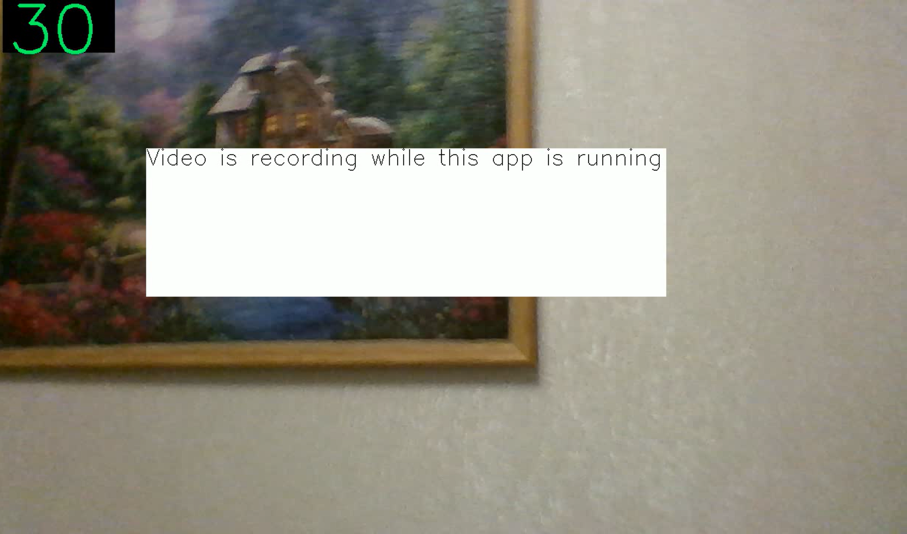

# OpenAR v1.2
Платформа для создания очков смешанной реальности

Форк проекта [AR_headset](https://github.com/ZernovTechno/AR_headset). 

[Документация](docs/docs.md)

[Туториал по созданию приложений](docs/tutorials/index.md)

Рекомендуемая версия Python 3.12

## Возможности платформы
1. Контроль прав для приложений
2. Распознавание жестов: двойная и тройная щепотка
3. Двигаются окна

## TODO
1. Поддержка гироскопа
2. Портировать на андроид