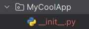
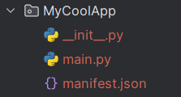

# Создание приложения

Наша цель сделать платформу OpenAR максимально удобной и простой для разработчиков и при этом сделать её функциональной.
Поэтому создание первого приложения должно быть очень простым и понятным. 

## Коротко об устройстве приложения
Начнём с того, каждое приложение - Python пакет, в котором определён класс приложения и его манифест.

**Манифест** нужен для хранения информации о приложении, чтобы система могла настраивать его и управлять им.

**Класс** позволяет удобно организовывать код

Таким образом, эти 2 файла (3, если считать пустой `__init__.py`) - это минимальный набор, чтобы создать рабочее приложение.

## Создаём структуру директорий
Сначала необходимо создать Python-пакет. Для этого создадим папку с названием нашей программы, а внутри неё - пустой файл `__init__.py`.

*Если вы используете среду разработки, например, PyCharm, IDE может автоматически создать этот файл*



Рядом с `__init__.py` создаём файл `main.py` и объявляем в нём класс приложения:

```python
from gui.abstract.app import Application


class App(Application):
    pass
```
Удивительно, но это вполне самодостаточный код, который может даже отобразить окно.

Пока не будем углубляться в возможности настройки и кастомизации и перейдём к следующему шагу.

Рядом, в этой же папке создаём файл `manifest.json` со следующим содержимым:
```json
{
  "manifest-version": 1.0,
  "name": "My Cool App",
  "permissions": [],
  "size": [700, 500]
}
```
Параметр `name` задаёт отображаемое имя приложения. Это может быть любая Unicode строка.

Параметр `size` определяет размер окна при запуске приложения

Поля `manifest-version` и `permissions` пока оставим без объяснений.

Должна получиться следующая структура:



Всё готово, помещаем папку MyCoolApp в каталог apps системы OpenAR.
Наше новое приложение готово к запуску.